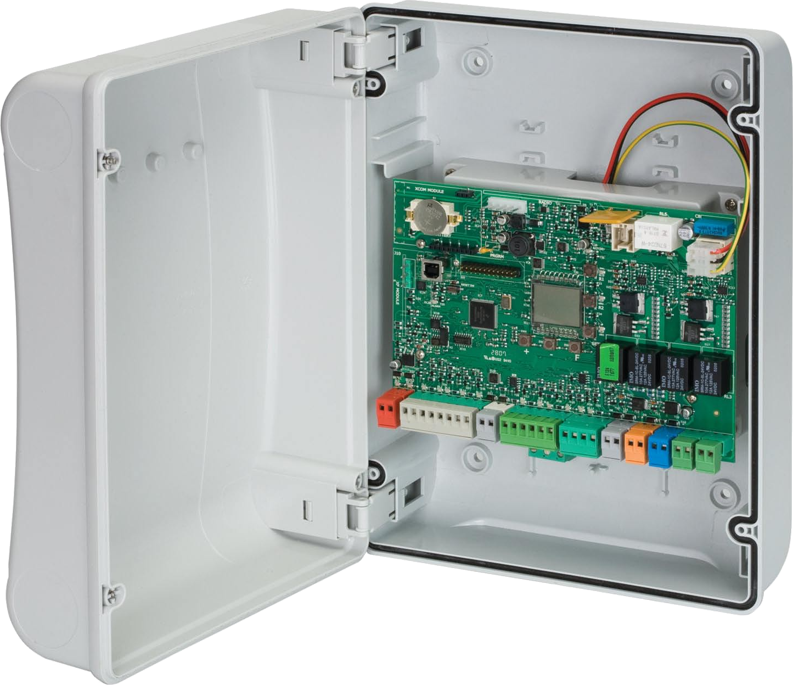

# Gatecontrol

[](https://app.travis-ci.com/owahlen/gatecontrol)

REST service for a Raspberry Pi operating an FAAC-E124 gate control unit.

## Controlling a gate with Apple Hardware
The goal of this project is to control an entry gate with an Apple device (e.g. iPhone or Apple Watch).
More specifically the gate is represented as an [HomeKit accessories](https://www.apple.com/ios/home)
and controlled with [Siri](https://www.apple.com/siri) or the
[Home app](https://apps.apple.com/de/app/home/id1110145103).

## Homebridge configuration
HomeKit requires a [home hub](https://support.apple.com/en-gb/HT207057) (e.g. an Apple TV) to be installed on the local network.
The home hub connects to Apple servers and allows the Home app to control HomeKit accessories even
from outside the local network.

Currently, few accessories natively support HomeKit.
The [Homebridge](https://homebridge.io) project allows integration of smart home devices
that do not natively support HomeKit. The software can be installed on a
[Raspberry Pi](https://www.raspberrypi.org/products/raspberry-pi-4-model-b)
that is placed into the local network.
Homebridge registers with the home hub and exposes accessories to HomeKit through installable plugins.
It is configured through a web interface under `http://ip_address_of_raspberrypi:8581`.

For the gate in this project to be exposed as HomeKit accessory the
[homebridge-http-webhooks](https://github.com/benzman81/homebridge-http-webhooks) plugin
needs to be installed. The
[HttpWebHooks.json](documentation/HttpWebHooks.json) file
gives an example on how to configure the plugin.
Note that [Basic Auth](https://en.wikipedia.org/wiki/Basic_access_authentication) is used to secure the communication
between the gate hardware and Homebridge. Decide for a `user` and `password` and replace the string
`xxxxxxxxxxxxxxxxxxxxxxxxxx==` in the config  with the outcome of running the following command in a shell:
```
echo -n user:password | base64
```
Also note that `ip_address_of_pi_zero` needs to be replaced with the ip address
of the Raspberry Pi Zero WH mentioned below.

## Gate Hardware
The hardware that is used to control the entrance gate is a FAAC-E124 Control Unit.



Since the E124 does not provide any way to interface with the Homebridge it is extended with the following
hardware components:
* [Raspberry Pi Zero WH](https://www.amazon.de/Raspberry-Pi-Zero-WH/dp/B07BHMRTTY)
* [DIDO module](https://www.amazon.de/Modul-Digital-Output-Module-Raspberry/dp/B07KZQCS38)
* [4 Channel Optocoupler](https://www.amazon.de/gp/product/B07Y8LFJBT)
* [USB Powerconverter](https://www.amazon.de/gp/product/B07XT8V97Y)

### Circuit Diagram
These components need to be connected according to the following circuit diagram:


## FAAC-E124 Control Unit Configuration
Please refer to the [FAAC-E124 manual](http://www.faac.co.uk/productfiles/245_Manual_rad0ADBE.pdf)
for details on the control unit. Chapter 5 of the document explains how to program the device.
The following values need to be configured:
```
LO = E or EP
o1 = 05
o2 = 06
```

Setting `LO` to either `E` or `EP` configures the input `IN 1` to operate the gate semi-automatically:
A first impulse on the input will open the gate. A second one will close it.
Configuring `o1` to `05` activates output `OUT 1` in _OPEN_ or _PAUSE_ state of the gate.
Setting `o2` to `06` activates output `OUT 2` in _CLOSED_ state.

## Raspberry Pi Zero WH Configuration
Please see the [Getting started](https://www.raspberrypi.org/products/raspberry-pi-zero-w)
instructions for setting up the Raspberry Pi Zero WH.
It is mandatory to configure the Pi Zero for remote access in the local network via
[SSH](https://www.raspberrypi.org/documentation/computers/remote-access.html).

### Install the _gatecontrol_ web service
As a next step the _gatecontrol_ web service must be installed on the Pi Zero.
This services operate the gate hardware and interfaces with the homebridge-http-webhooks plugin.
Copy the whole `gatecontrol` directory into the folder `/home/pi` on the device.
```
scp -R gatecontrol pi@ip_address_of_pi_zero:
```

Make sure python3 and all required modules are installed:
```
sudo apt update
sudo apt install python3
sudo pip3 install -r /home/pi/gatecontrol/requirements.txt
```

### Start _gatecontrol_ service at boot time
Adjust the file [gatecontrol.service](documentation/gatecontrol.service)
to your needs and copy it into the folder `/lib/systemd/system` on the Pi Zero.
Configure it as a systemd service:
```
sudo systemctl daemon-reload
sudo systemctl enable gatecontrol.service
sudo systemctl start gatecontrol.service
```

### Environment Variables
The following environment variables can be set to configure the service.
If a variable is not defined the value in brackets is used as default.
The basic authentication is activated if both `BASIC_AUTH_USERNAME` and `BASIC_AUTH_PASSWORD` are provided.

* `HOST` (0.0.0.0): The host interface where this service is running
* `PORT` (8000): The port the service is listening
* `BASIC_AUTH_USERNAME`: The username that must be passed to the service in a basic auth header
* `BASIC_AUTH_PASSWORD`: The password that must be passed to the service in a basic auth header
* `WEBHOOK_URL` (http://localhost:51828): The URL of the homebridge running the _Homebridge Webhooks_ plugin
* `ACCESSORY_ID` (gatecontrol): The accessory ID as configured as gate in the _Homebridge Webhooks_ plugin

### _gatecontrol_ API Documentation
The service utilizes the [FastAPI](https://fastapi.tiangolo.com/) framework.
It generates an OpenAPI under the URL `http://HOST:PORT/docs` e.g. http://ip_address_of_pi_zero:8000/docs.
