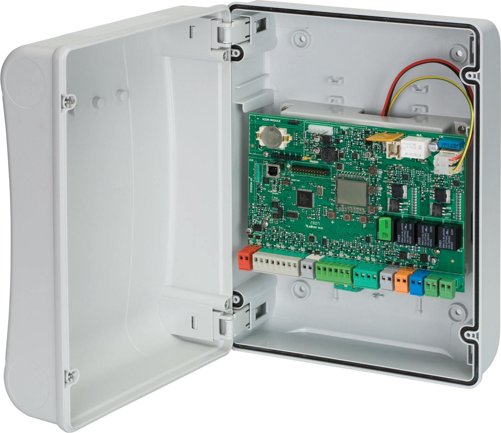

# Gatecontrol

Go service for a Raspberry Pi Zero W operating a FAAC-E124 gate control unit
through a DIDO relay board and MQTT.

## Overview

The service subscribes to MQTT commands, pulses the DIDO relay connected to the
FAAC `IN 1` input, and publishes the assumed gate state back to MQTT.

There is no USB FAAC protocol support in this project. The FAAC control is
operated through the existing DIDO board only.

## MQTT Topics

The MQTT base topic defaults to `faac/gate`.

### `faac/gate/command`

Inbound command topic. Supported payloads:

```text
open
close
```

### `faac/gate/state`

Retained state topic. Published payloads:

```text
OPEN
CLOSED
```

The service starts with assumed state `CLOSED`. Because no feedback pins are
connected yet, this state is based on the last successful command, not on real
gate position.

### `faac/gate/target_state`

Retained target topic. Published payloads:

```text
open
close
```

### `faac/gate/availability`

Retained availability topic. Published payloads:

```text
online
offline
```

## Gate Hardware

The hardware that is used to control the entrance gate is a FAAC-E124 Control
Unit.



The FAAC unit is extended with:

* Raspberry Pi Zero W
* DIDO module with MCP23S17-compatible SPI GPIO expander
* 4 Channel Optocoupler
* USB Powerconverter

### Circuit Diagram

These components need to be connected according to the following circuit
diagram:


## FAAC-E124 Control Unit Configuration

Please refer to the FAAC-E124 manual for details on the control unit. Chapter 5
of the document explains how to program the device.

The following values need to be configured:

```text
LO = E or EP
o1 = 05
o2 = 06
```

Setting `LO` to either `E` or `EP` configures input `IN 1` to operate the gate
semi-automatically: a first impulse opens the gate, a second impulse closes it.

`o1` and `o2` are documented for future input feedback. The current Go service
does not read those outputs yet.

## Configuration

Environment variables:

* `MQTT_BROKER` (default: `localhost`): MQTT broker hostname or IP address
* `MQTT_PORT` (default: `1883`): MQTT broker port
* `MQTT_CLIENT_ID` (default: `gatecontrol`): MQTT client id
* `MQTT_USERNAME`: optional MQTT username
* `MQTT_PASSWORD`: optional MQTT password
* `MQTT_BASE_TOPIC` (default: `faac/gate`): MQTT base topic
* `LOG_LEVEL` (default: `info`): `debug`, `info`, `warn`, or `error`
* `SPI_BUS` (default: `0`): SPI bus used by the DIDO board
* `SPI_CHIP_SELECT` (default: `0`): SPI chip select used by the DIDO board
* `SPI_HARDWARE_ADDR` (default: `0`): MCP23S17 hardware address
* `DIDO_RELAY_PIN` (default: `0`): DIDO output pin used for the relay
* `SPI_SPEED_HZ` (default: `100000`): SPI transfer speed
* `PULSE_LENGTH_MS` (default: `500`): relay active time and follow-up delay
* `USE_MOCK_DIDO` (default: `false`): use in-memory DIDO mock
* `USE_MOCK_MQTT` (default: `false`): use in-memory MQTT mock

## Build

Local build:

```bash
go build ./cmd/gatecontrol
```

Run tests:

```bash
go test ./...
```

Cross-compile for the original Raspberry Pi Zero W:

```bash
GOOS=linux GOARCH=arm GOARM=6 CGO_ENABLED=0 go build -o bin/gatecontrol-armv6 ./cmd/gatecontrol
```

## Raspberry Pi Setup

Enable SPI on the Pi:

```bash
sudo raspi-config
```

Then check that a device such as `/dev/spidev0.0` exists:

```bash
ls -l /dev/spidev*.*
```

Copy the compiled binary to the Pi, for example:

```bash
scp bin/gatecontrol-armv6 pi@ip_address_of_pi_zero:/home/pi/gatecontrol/gatecontrol
```

Adjust [gatecontrol.service](documentation/gatecontrol.service), copy it to
`/lib/systemd/system`, and enable the service:

```bash
sudo systemctl daemon-reload
sudo systemctl enable gatecontrol.service
sudo systemctl start gatecontrol.service
```

## Local Mock Run

The mock DIDO backend mimics the relay pulse sequence without touching
`/dev/spidev*`.

```bash
USE_MOCK_DIDO=true USE_MOCK_MQTT=true go run ./cmd/gatecontrol
```

## Current Limitations

The service does not read gate feedback inputs yet. It assumes the gate is
initially `CLOSED` and updates the state after successful commands. The assumed
state can be wrong if the gate is operated by another remote, keypad, wall
switch, safety stop, obstacle detection, or power interruption.

## Related Projects

* [FAAC-E145-Gate-Connect](https://github.com/jens62/FAAC-E145-Gate-Connect) -
  similar FAAC work for a different board and protocol
